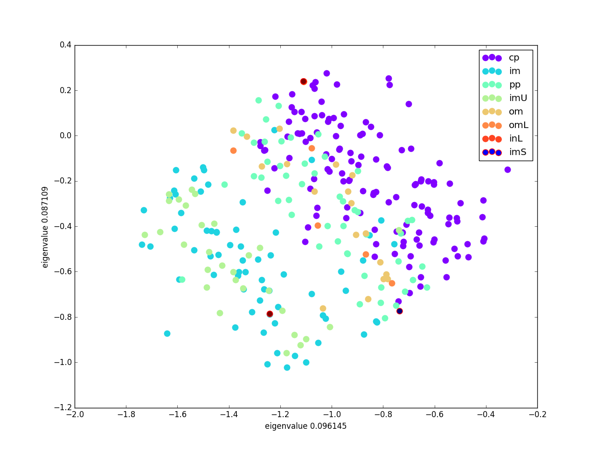

## Environment

* Ubuntu 16.04 LTS
* python2.7.12(using Pycharm 2017.2.3)
* extra module: numpy, sklearn, pandas, matplotlib

## Usage

Run the following command, this will display the accuracy of KNN and the k nearest neighbor's index of first three test data using different K (1, 5, 10, 100), along with PCA version of KNN.
```
./run.sh <train file.csv> <test file.csv>
```

Output format:

```
KNN accuracy:  1.0
286
151
149

KNN accuracy:  0.861111111111
286 87 252 142 226
151 282 276 71 221
149 219 257 283 79

KNN accuracy:  0.888888888889
286 87 252 142 226 158 60 247 141 293
151 282 276 71 221 84 81 289 49 10
149 219 257 283 79 239 249 227 210 99

KNN accuracy:  0.583333333333
286 87 252 142 226 158 60 247 141 293 85 171 202 299 30 111 150 44 3 223 198 102 263 193 96 209 143 119 145 15 163 39 211 180 68 29 284 120 53 237 0 205 113 80 50 98 296 267 196 212 40 23 241 118 190 16 189 240 56 115 191 259 106 156 235 4 246 162 101 2 70 233 238 109 173 184 270 36 54 243 37 279 116 177 41 108 260 297 27 242 187 206 232 281 124 217 200 225 288 265
151 282 276 71 221 84 81 289 49 10 195 92 117 174 91 9 199 274 79 253 82 227 292 34 249 69 140 250 181 191 201 53 271 260 72 210 239 216 288 265 219 284 48 76 184 215 175 121 161 232 143 194 208 104 133 62 243 182 285 12 183 228 146 149 19 261 267 254 125 266 189 236 124 14 220 205 89 272 57 65 100 108 235 264 294 96 162 46 127 196 230 296 238 45 80 200 283 66 139 99
149 219 257 283 79 239 249 227 210 99 67 285 34 91 169 215 33 264 97 155 251 78 112 51 253 195 18 21 43 65 290 49 127 133 170 100 199 140 216 66 82 292 161 224 276 288 262 207 234 274 174 229 52 117 282 186 166 184 88 135 110 74 261 7 77 9 182 179 46 72 295 176 238 139 56 194 157 289 153 231 57 10 12 269 152 201 19 258 20 105 244 28 221 172 93 92 81 275 151 71

K = 5, KNN_PCA accuracy: 0.861111
```

If you want to see the whole result of the PCA version of KNN, run the following command:
```
python2 PCA.py <train file.csv> <test file.csv>
```
It's output format is the same as original KNN, but with M dimension of data (M=1~D, D=original dimension) after PCA transform the original training data.
And when M=2, it will plot the data distribution of all class using the most contributive pair of eigenvalue.


Last, it will show the best dimension to have the highest average accuracy above all K.

For detailed discussion in chinese, please refer to this [report](REPORT.md).